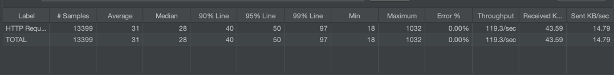
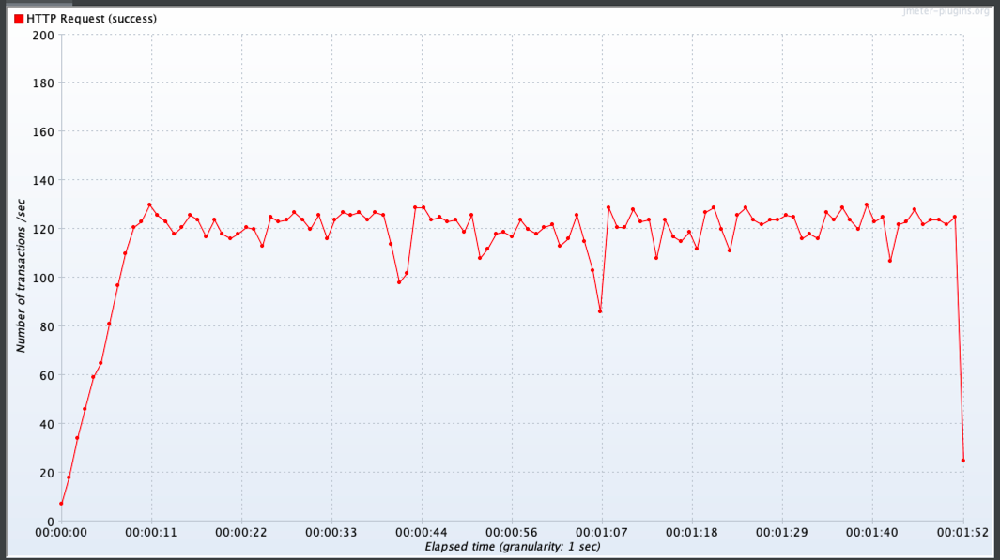
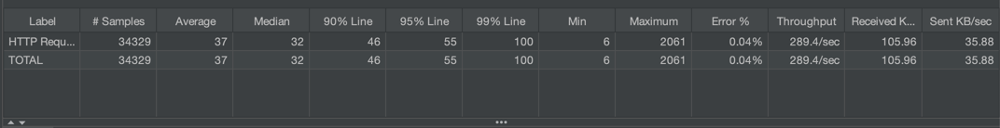
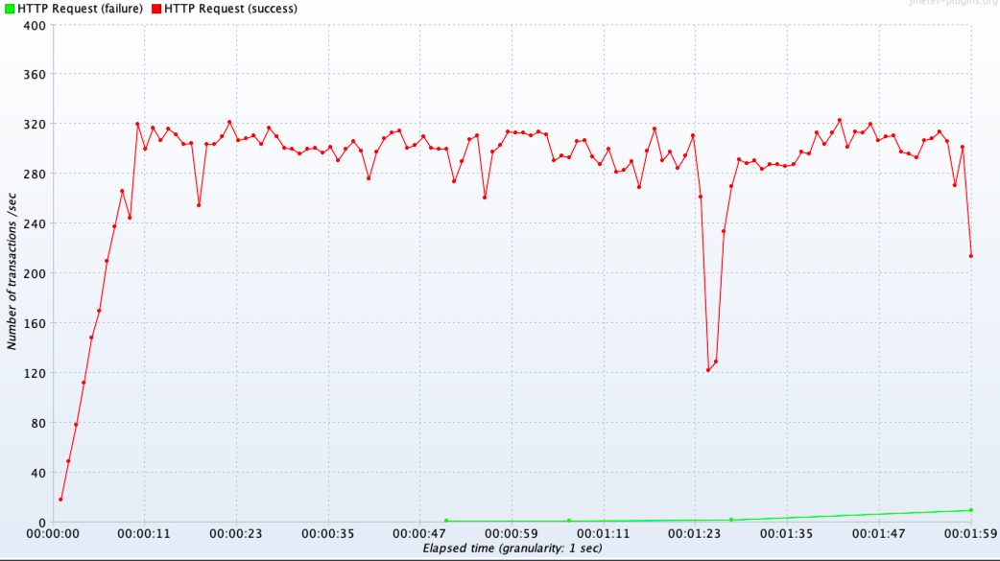

# Blue-Green 배포 전략

쿠버네티스 서비스 Selector를 수동으로 패치하여 Blue-Green 배포 시험


## Deployment 및 Service 적용
```
kubectl apply -f blue-deployment.yaml
kubectl apply -f green-deployment.yaml
kubectl apply -f blue-green-servicesdeployment.yaml
kubectl apply -f ssl-service-host-ingress.yaml
```
현재 naver-blue 팟으로 연동

## Service를 Green으로 연결하기
```
kubectl patch service naver -p '{"spec":{"selector":{"app":"naver", "version":"green"}}}'
```

naver-green으로 연동


## 서비스 패치시 순단 여부

### 100TPS
순단 문제가 발생하지 않았다.




### 300TPS
서비스 Patch 중에 전체 요청 중 0.04% 에러응답이 발생한다.


