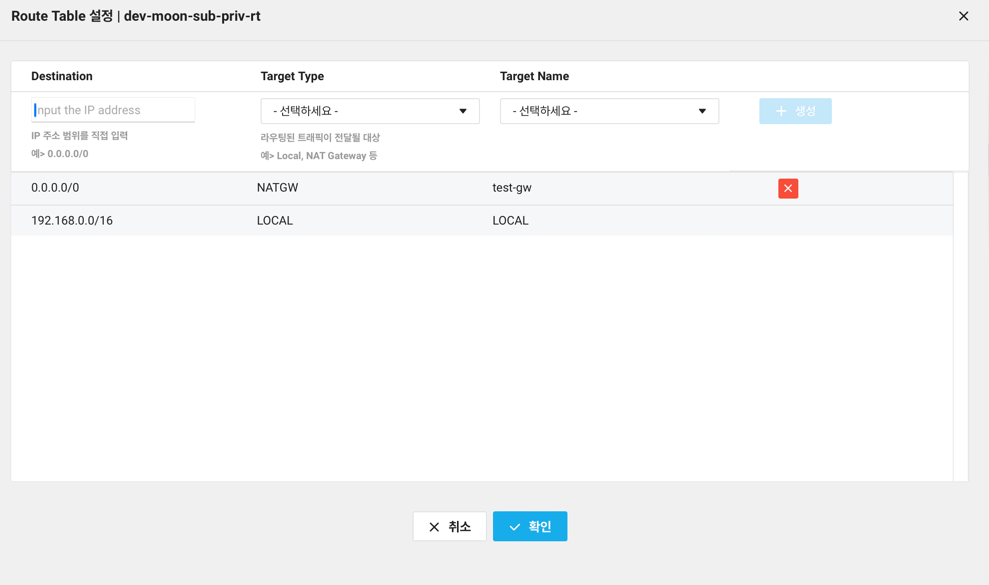

# NCP 도커 쿠버네티스 기본 사용
NCP에서 제공하는 쿠버네티스 서비스에 간단한 이미지 배포 

## 사전 준비
* VPC 서브넷 생성
* NCP에 도커 레지스트리 서비스 신청 
* NPC에 쿠버네티스트 클러스터 생성
* 쿠버네티스 Private Subnet이 포함된 라우터 테이블에 NetGW 추가 되어있어야 함  
  (Private Subnet에서 nginx 이미지를 Pull 하기 위한 Docker Hub에 접근 용도, [lb-deployment.yaml](lb-deployment.yaml))



## 1. 도커 로그인 및 빌드
```
$ docker login ${NCP_DOCKER_REGISTRY}
$ docker build -t ${NCP_DOCKER_REGISTRY}/ncp-k8s-simple:latest .
$ docker push ${NCP_DOCKER_REGISTRY}/ncp-k8s-simple:latest
```


## 2. kubectl 설치 및 kubeconfig 설정 (MacOS, Homebrew 기준)
참고 : https://kubernetes.io/ko/docs/tasks/tools/
```
# 설치
$ brew install kubectl
$ kubectl version --client

# NCP IAM인증 NCP kubeconfig 설정
$ brew tap NaverCloudPlatform/tap
$ brew install ncp-iam-authenticator

# NCP API 키 설정 
# https://guide.ncloud-docs.com/docs/k8s-iam-auth-kubeconfig
$ echo "[DEFAULT] \n\
ncloud_access_key_id = ${ACESSKEY} \n\
ncloud_secret_access_key = ${SECRETKEY} \n\
ncloud_api_url = https://ncloud.apigw.ntruss.com \n\
\n\
[project] \n\
ncloud_access_key_id = ${ACESSKEY} \n\
ncloud_secret_access_key = ${SECRETKEY} \n\
ncloud_api_url = https://ncloud.apigw.ntruss.com" > ~/.ncloud/configure 

$ ncp-iam-authenticator create-kubeconfig --region KR --clusterUuid ${cluster-uuid} --output kubeconfig.yaml
$ kubectl --kubeconfig kubeconfig.yaml get nodes
```

## 2. NCP 도커 레지스트리 관련 쿠버네티스 시크릿 추가
```
$ kubectl create secret docker-registry ncloud-registry-secret \
  --docker-server=action.kr.ncr.ntruss.com \
  --docker-username=${NCP_DOCKER_USERNAME}> \
  --docker-password=${NCP_DOCKER_PASSWORd}
```


## 3. Deployment 및 Service 배포
```
# NCP 로드밸런드
$ kubectl apply -f lb-deployment.yaml
# 웹 도커 배포
$ kubectl apply -f web-deployment.yaml
```

## 4. 배포된 팟 상태 확인
```
$ kubeclt --kubeconfig kubeconfig.yaml get pods

# 출력 예시
# NAME                                     READY   STATUS    RESTARTS      AGE
# my-nginx-5c8888cd5c-vxvss                1/1     Running   1 (76s ago)   2m38s
# sample-app-deployment-7c66d6bf7c-7czql   1/1     Running   0             113s
# sample-app-deployment-7c66d6bf7c-sbz2j   1/1     Running   0             113s
# sample-app-deployment-7c66d6bf7c-zzmln   1/1     Running   0             113s

```


## 5. 연결 확인
```
$ curl http://<로드밸런서 IP>

# 출력 예시
# Hello Kubernetes!

```
